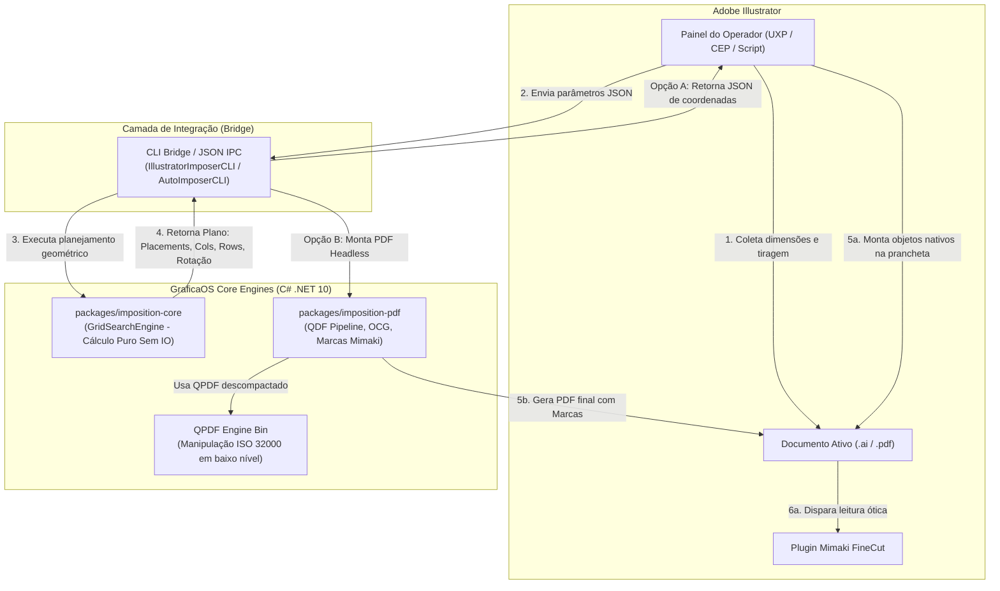
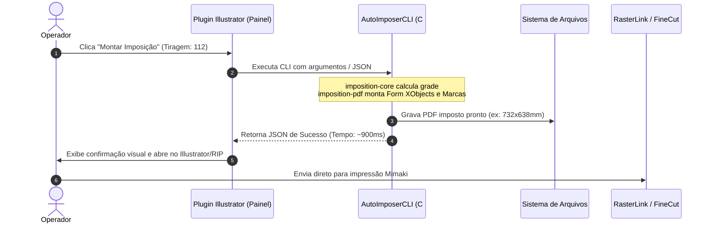
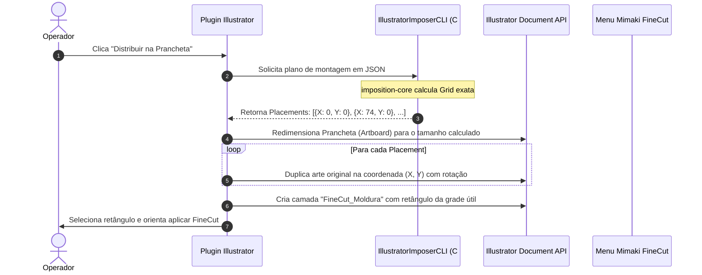

# Documentação Técnica e Arquitetura: Plugin Adobe Illustrator & Motores C# de Imposição

> **Destinatários:** Product Owner (PO), Arquitetos de Software e Desenvolvedores de Plugins/Extensões (CEP/UXP/ExtendScript).  
> **Objetivo:** Especificar a arquitetura completa, os modelos de dados, os contratos e os algoritmos dos motores de imposição em C# (.NET 10) que sustentam a solução de plugin para o Adobe Illustrator no ecossistema GraficaOS.  
> **Status:** Aprovado / Especificação Canônica.

---

## 1. Sumário Executivo e Visão de Negócio

### 1.1 O Problema
Em gráficas rápidas e industriais, a montagem manual de pranchas e bobinas de impressão (*imposição* ou *step & repeat*) no Adobe Illustrator é um processo:
- **Lento e repetitivo:** O operador gasta minutos calculando colunas, linhas, margens e duplicando objetos manualmente.
- **Propenso a erro humano:** Falhas de milímetros no alinhamento quebram o corte em plotters digitais (ex: Mimaki, Roland) e geram refugo de substrato caro (vinil, lona, acrílico).
- **Sem otimização matemática:** O operador raramente testa se rotacionar a peça a 90° economizaria metros lineares de material ou se uma tiragem específica fecha melhor com sobra mínima de refile.
- **Conflito de marcas de corte:** Desenhar ou calibrar marcas de registro (como o sensor ótico Mimaki Tipo 1 / FineCut) exige coordenadas exatas e camadas especiais de spot color que frequentemente são configuradas incorretamente.

### 1.2 A Solução
Criar uma **extensão/plugin nativo para o Adobe Illustrator** alimentado pelo motor de engenharia **C# (.NET 10)** do GraficaOS:
1. **Uma Única Fonte de Verdade:** Toda a matemática geométrica, tolerâncias físicas e cálculos de aproveitamento residem no pacote central `imposition-core`. O plugin não reimplementa regras de três nem loops ad-hoc.
2. **Dois Modos de Operação no Illustrator:**
   - **Modo Headless (Fundo / Alta Performance):** O motor C# + QPDF compõe o arquivo final em frações de segundo diretamente em PDF vetorial, com camadas OCG de corte e marcas Mimaki prontas.
   - **Modo Bancada (Interativo na Prancheta):** O motor C# calcula a grade ideal e o plugin duplica os elementos vetoriais diretamente dentro do documento ativo do Illustrator, desenhando a moldura de registro para o FineCut com 1 clique.
3. **Precisão Industrial:** Tolerância física real de `0,1 mm` (espessura da lâmina de corte), sem números mágicos de arredondamento (*epsilon*).

---

## 2. Arquitetura Macro da Solução

O ecossistema divide as responsabilidades estritamente entre a **interface com o usuário** (Illustrator) e o **motor de inteligência gráfica** (C#):



### 2.1 Por que desacoplar em C#?
1. **Velocidade Bruta:** O cálculo de busca exaustiva de dezenas de combinações de colunas, linhas, margens e rotações roda em menos de 1 milissegundo em C# (.NET 10). Em ExtendScript (JavaScript antigo do Illustrator), loops semelhantes causam travamento de tela.
2. **Preservação de Camadas OCG (ISO 32000):** O motor C# integrado ao QPDF preserva intactas as camadas de corte (`CutContour`), vinco e verniz, garantindo que o arquivo não sofra *flattening* (achatamento de camadas).
3. **Consistência Cross-Platform:** A mesma matemática que roda dentro do Illustrator é a que roda no ERP Web (Node/TS), no aplicativo de balcão (Electron) e nos robôs de linha de comando.

---

## 3. O Núcleo Geométrico: `imposition-core`

O pacote `packages/imposition-core/` é uma biblioteca C# **100% pura (sem dependências externas e sem qualquer chamada de IO de disco ou rede)**.

### 3.1 Regras Fundamentais do Core (Diretrizes de Governança)
- **Regra 1 — Tolerância Física Explícita:** Nunca usar números mágicos como `+0.000001` nem `decimal`/`Big.js`. Usa-se `double` com a tolerância industrial calculada antes da divisão inteira (`floor`):
  $$\text{tol} = \max(\text{toleranceMm}, \text{registerMm}, 0.1)$$
  $$\text{cols} = \left\lfloor \frac{\text{utilWidth} + \text{gap} + \text{tol}}{\text{pieceWidth} + \text{gap}} \right\rfloor$$
- **Regra 2 — Nunca Transbordar Silenciosamente:** Se um layout não cabe no substrato fixo (`fits = false`), ele é rejeitado antes de receber nota de custo. Em substrato de **rolo**, o comprimento se auto-estende até o limite configurado (`maxLengthMm`).
- **Regra 3 — Contagem Verificada:** Se o motor reporta `108` unidades planejadas, a geometria retornada contém exatamente `108` posições.

---

### 3.2 Estruturas de Dados Públicas (DTOs Imutáveis)

#### `ImpositionInput` (Entrada do Cálculo)
Representa os parâmetros fornecidos pelo operador ou pelo plugin:

```csharp
public sealed record ImpositionInput(
    double SheetWidthMm,       // Largura do substrato (ex: 700 mm)
    double? SheetHeightMm,     // Altura da chapa (null se for bobina/rolo contínuo)
    double GapMm,              // Distância entre peças (ex: 0 mm ou 2 mm)
    double MarginTopMm,        // Margem superior do substrato
    double MarginRightMm,      // Margem lateral direita
    double MarginBottomMm,     // Margem inferior
    double MarginLeftMm,       // Margem lateral esquerda
    double PieceWidthMm,       // Largura da arte gráfica (já com sangria, se houver)
    double PieceHeightMm,      // Altura da arte gráfica
    int TargetCopies,          // Quantidade desejada pelo cliente (ex: 200 UN)
    bool ForceOrientation,     // Se true, não testa rotação automática
    SurplusPolicy Surplus,     // Política de excedente (FillRow ou CutExact)
    SubstrateKind Substrate,   // Sheet (chapa fixa) ou Roll (bobina contínua)
    double? MaxLengthMm = null,// Comprimento máximo permitido para rolo
    double RegisterMm = 0.1,   // Tolerância de registro de máquina (padrão: 0.1mm)
    double BladeMm = 0.0       // Espessura da lâmina de corte
);
```

#### `Enums` Auxiliares
```csharp
public enum Orientation
{
    Portrait = 0,   // Direto (0 graus)
    Landscape = 90  // Rotacionado 90 graus no sentido anti-horário (CCW)
}

public enum SurplusPolicy
{
    FillRow,        // Preenche a última linha completa (gera sobras seguras para refile)
    CutExact        // Interrompe exatamente no número pedido (deixa espaços vazios na linha)
}

public enum SubstrateKind
{
    Sheet,          // Chapa / Folha de formato fixo (700x1000, SRA3, etc.)
    Roll            // Bobina / Rolo de comprimento livre (Mimaki, HP Latex, etc.)
}
```

#### `ImpositionPlan` (Saída do Cálculo)
O resultado completo calculado pelo `GridSearchEngine`:

```csharp
public sealed record ImpositionPlan(
    int Cols,                              // Número de colunas
    int Rows,                              // Número de linhas
    int PlannedUnits,                      // Total de unidades que serão impressas
    int RequestedUnits,                    // Total de unidades solicitadas originalmente
    int SurplusUnits,                      // Quantidade de unidades excedentes (sobra de produção)
    Orientation Orientation,               // Orientação vencedora (0° ou 90°)
    double SheetWMm,                       // Largura final da folha/bobina considerada
    double LengthMm,                       // Comprimento total consumido (útil + margens)
    double UtilizationRate,                // Taxa de aproveitamento de área útil (0.0 a 1.0)
    double WasteAreaMm2,                   // Área total desperdiçada em mm²
    IReadOnlyList<Placement> Placements    // Lista com as coordenadas exatas de cada peça
);
```

#### `Placement` (Posicionamento Unitário)
A coordenada exata de cada cópia na prancha:

```csharp
public sealed record Placement(
    int Index,         // Índice da peça (0-based)
    int Col,           // Índice da coluna (0 .. Cols-1)
    int Row,           // Índice da linha (0 .. Rows-1)
    double XMm,        // Posição X da quina inferior-esquerda da peça (em mm)
    double YMm,        // Posição Y da quina inferior-esquerda da peça (em mm)
    double WidthMm,    // Largura do slot ocupado nesta orientação
    double HeightMm,   // Altura do slot ocupado nesta orientação
    bool Rotated       // Se a peça está rotacionada 90 graus
);
```

---

### 3.3 O Algoritmo de Otimização (`GridSearchEngine`)

O motor executa os seguintes passos analíticos para encontrar o melhor arranjo:

1. **Cálculo da Área Útil:**
   $$\text{utilW} = \text{SheetWidthMm} - (\text{MarginLeftMm} + \text{MarginRightMm})$$
   $$\text{utilH} = \text{SheetHeightMm} - (\text{MarginTopMm} + \text{MarginBottomMm}) \quad \text{(se Chapa)}$$
2. **Avaliação Bi-Direcional (0° e 90°):**
   - Testa a arte direta ($W \times H$) e rotacionada ($H \times W$).
   - Para cada orientação, calcula o número máximo de colunas que cabem na largura útil com a tolerância de 0,1 mm.
3. **Janela de Busca de Colunas:**
   - Em bobinas contínuas, não basta pegar o número máximo de colunas; o motor avalia uma janela descrescente de colunas ($C_{\max}, C_{\max}-1, \dots$). Frequentemente, usar 1 coluna a menos reduz em 1 linha a tiragem total, economizando vários metros de bobina.
4. **Função de Custo (Otimizador):**
   - A função avalia:
     $$\text{Custo} = (\text{Área Desperdiçada}) \times 1.0 + (\text{Sobras Não Desejadas}) \times 1.5 + (\text{Penalidade de Rotação}) \times 0.05$$
   - O plano com menor custo vence a seleção automaticamente.
5. **Centralização Matemática (ADR-021):**
   - O motor centraliza o bloco da grade no substrato:
     $$\text{offset}_X = \text{MarginLeftMm} + \frac{\text{utilW} - (\text{Cols} \times \text{slotW} + (\text{Cols}-1) \times \text{gap})}{2}$$
     $$\text{offset}_Y = \text{MarginBottomMm} + \frac{\text{utilH} - (\text{Rows} \times \text{slotH} + (\text{Rows}-1) \times \text{gap})}{2} \quad \text{(em Chapa)}$$
   - Em rolo contínuo, o Y inicia imediatamente após a margem superior (não há centralização vertical em bobina).

---

### 3.4 Gestão de Excesso de Tiragem (Protocolo de Multi-Rodadas)

Quando o operador escolhe uma **Chapa Fixa** (ex: 700x1000 mm) e o pedido é superior ao que cabe em uma única chapa (ex: Pedido = 200 UN, mas cabem apenas 108 UN):

1. O motor **rejeita** a montagem em chapa única com o erro `E_GRID_OVERFLOW`.
2. O CLI responde com o **Exit Code 4** e gera 3 alternativas automáticas no canal de erro:
   - `OPTION_1`: Rodar 1 chapa no limite máximo (108 UN).
   - `OPTION_2`: Rodar 2 chapas completas de 108 UN = 216 UN (sobra de 16 UN para refile).
   - `OPTION_3`: Dividir o pedido igualmente em 3 chapas balanceadas de 72 UN = 216 UN (todas com matrizes idênticas).
3. O plugin do Illustrator pode exibir essas 3 opções visualmente em botões para o operador decidir com 1 clique.

---

## 4. O Motor PDF e Manipulação Gráfica: `imposition-pdf`

O pacote `packages/imposition-pdf/` implementa a renderização vetorial e a manipulação de baixo nível em arquivos PDF conforme a norma **ISO 32000-1**.

### 4.1 Pipeline de Preservação QDF (`QdfPipeline`)
Softwares gráficos como o Adobe Illustrator geram arquivos PDF modernos (versão 1.5 a 1.7) contendo **Object Streams (`/Type /ObjStm`)**. Isso compacta os dicionários de página dentro de streams binários internos.

O pipeline de execução resolve isso em 4 etapas:
1. **Desempacotamento Normalizado:**
   ```powershell
   qpdf --qdf --object-streams=disable input.pdf temp.qdf
   ```
   A flag `--object-streams=disable` desmembra todos os objetos de página (`/Type /Page`) e recursos para o nível raiz, permitindo que o C# inspecione e edite as páginas sem quebra de referências.
2. **Form XObject Instantiation (`/Fm0 Do`):**
   - O conteúdo vetorial da página original é encapsulado em um único objeto do tipo `/Subtype /Form`.
   - Na página de imposição, o motor não duplica os vetores (o que explodiria o tamanho do arquivo). Ele apenas invoca a matriz de transformação `cm` e executa `/Fm0 Do` para cada uma das `N` posições.
3. **Preservação de Camadas OCG (Optional Content Groups):**
   - O dicionário `/OCProperties` da raiz do documento é preservado intacto.
   - Camadas de corte (`CutContour`), registro e arte mantêm suas visibilidades originais.
4. **Recompactação Otimizada:**
   ```powershell
   qpdf --object-streams=generate edited.qdf output.pdf
   ```
   Gera o PDF final ultraleve, com cross-reference table reconstruída e object streams ativos.

---

### 4.2 Sistema de Marcas Mimaki Tipo 1 (OutTombo / FineCut)

O plugin FineCut da Mimaki realiza a leitura ótica em plotters de recorte através de **4 marcas no formato "L"** posicionadas nos cantos externos da grade impressa.

```
(Top-Left)                                       (Top-Right)
┌                                                         ┐
    ┌───────────────────────────────────────────────┐
    │                                               │
    │             ÁREA ÚTIL DA GRADE                │
    │         (Peças Montadas pelo Core)            │
    │                                               │
    └───────────────────────────────────────────────┘
└                                                         ┘
(Bottom-Left)                                   (Bottom-Right)
```

#### Dimensões Físicas Canônicas
- **Comprimento das hastes:** $20{,}0\text{ mm}$ (cada braço do L tem 20 mm).
- **Espessura do traço (Stroke):** $1{,}0\text{ mm}$ (convertido no PDF para $2{,}8346\text{ pt}$).
- **Offset (distância da grade):** $3{,}0\text{ mm}$.
- **Orientação:** Cada canto forma uma "moldura" apontando para o interior da grade útil.

#### Geometria dos 4 Cantos (em pontos tipográficos pt)

| Canto | Ponto Externo Âncora $(X, Y)$ | Direção Haste Horizontal | Direção Haste Vertical | Glifo |
|---|---|---|---|:---:|
| **Superior Esquerdo (Top-Left)** | $(X_{\min} - \text{offset}, Y_{\max} + \text{offset})$ | Direita ($+X$) | Baixo ($-Y$) | `┌` |
| **Superior Direito (Top-Right)** | $(X_{\max} + \text{offset}, Y_{\max} + \text{offset})$ | Esquerda ($-X$) | Baixo ($-Y$) | `┐` |
| **Inferior Esquerdo (Bottom-Left)** | $(X_{\min} - \text{offset}, Y_{\min} - \text{offset})$ | Direita ($+X$) | Cima ($+Y$) | `└` |
| **Inferior Direito (Bottom-Right)** | $(X_{\max} + \text{offset}, Y_{\max} - \text{offset})$ | Esquerda ($-X$) | Cima ($+Y$) | `┘` |

#### Expansão Obrigatória do MediaBox
Para que as marcas não sejam desenhadas fora da área visível do documento, o `MediaBox` do PDF deve expandir exatamente o espaço reservado para as marcas:
$$\Delta W = 2 \times (\text{OffsetMm} + \text{SizeMm}) = 2 \times (3 + 20) = 46\text{ mm}$$
$$\Delta H = 2 \times (\text{OffsetMm} + \text{SizeMm}) = 2 \times (3 + 20) = 46\text{ mm}$$
- **Exemplo Real:** Grade de $686 \times 592\text{ mm} \implies \text{MediaBox Final} = 732 \times 638\text{ mm}$.

#### Especificação de Cor e Sintaxe PDF (ISO 32000-1)
Para compatibilidade absoluta com o Adobe Illustrator e com o leitor Mimaki:
1. **Espaço de Cor `/Separation`:** Registrado nos Recursos da página:
   ```pdf
   /CS_MimakiFCRM [
     /Separation /MimakiFCRM /DeviceCMYK
     <<
       /FunctionType 2
       /Domain [0 1]
       /C0 [0.0 0.0 0.0 0.0]
       /C1 [0.0 0.0 0.0 1.0]
       /N 1.0
       /Range [0.0 1.0 0.0 1.0 0.0 1.0 0.0 1.0]
     >>
   ]
   ```
2. **Operadores de Traço no Content Stream:**
   - O traço de separação exige operadores em caixa alta (`CS` e `SCN`). O uso de `sc` em separações é ilegal perante a norma ISO 32000.
   ```pdf
   /CS_MimakiFCRM CS
   1 SCN
   /CS_MimakiFCRM cs
   1 scn
   ```
3. **Proibição de Notação Exponencial:**
   - O parser do Illustrator rejeita tokens como `7.1054E-15`. Toda coordenada matemática deve ser formatada com sanitização estrita:
     ```csharp
     if (Math.Abs(val) < 1e-6) val = 0.0;
     ```

---

## 5. Modelos de Integração do Plugin com o Illustrator

Para o Product Owner definir a experiência de usuário (UX) do produto, a engenharia disponibiliza dois modelos de integração:

### 5.1 Modelo A — "Geração Direta em PDF" (Recomendado para Produção / RIP)
O operador seleciona o arquivo ou a arte atual, define a chapa e clica em **"Impor e Salvar"**.



- **Vantagem:** Desempenho instantâneo (< 1 segundo para centenas de cópias). Arquivo PDF leve, ultra-otimizado e padronizado.

---

### 5.2 Modelo B — "Imposição Vetorial em Bancada" (Modo Design / Ajuste Fino)
O operador já está com a arte aberta em um documento no Illustrator e deseja que as peças sejam duplicadas como **objetos vetoriais nativos** na prancheta.



#### Criação Automática da Moldura FineCut
No Modo Bancada, o script desenha um retângulo vetorial sem preenchimento, com traço preto de 0.5pt, contornando a grade útil na camada dedicada `FineCut_Moldura`. O operador precisa apenas selecionar esse objeto e executar o comando nativo do FineCut:
> **FineCut 9/10 $\to$ Frame Registration Marks $\to$ OK.**

---

## 6. Especificação dos Contratos de Comunicação (IPC / JSON)

Tanto o painel UXP/CEP quanto qualquer script externo invoca o motor C# via subprocesso (`child_process` em Node.js ou `File.execute` em ExtendScript).

### 6.1 Contrato de Requisição (Entrada via `--json`)

O executável CLI aceita um payload estruturado:

```json
{
  "InputPath": "C:/artes/rotulo_45x70mm.pdf",
  "OutputPath": "C:/saida/",
  "SheetWMm": 710.0,
  "SheetHMm": 1000.0,
  "GapMm": 0.0,
  "MarginTopMm": 0.0,
  "MarginRightMm": 0.0,
  "MarginBottomMm": 0.0,
  "MarginLeftMm": 0.0,
  "ArteWMm": 49.0,
  "ArteHMm": 74.0,
  "TargetCopies": 112,
  "ForceRotation": null,
  "SurplusPolicy": "fill_row",
  "SubstrateKind": "sheet",
  "TrimToContent": true,
  "Marks": {
    "Enabled": true,
    "Type": "mimaki-fcrm",
    "SizeMm": 20.0,
    "OffsetMm": 3.0
  }
}
```

### 6.2 Contrato de Resposta (Saída via `stdout`)

O motor retorna um objeto JSON parseável:

```json
{
  "success": true,
  "exitCode": 0,
  "message": "Imposição concluída com sucesso.",
  "executionTimeMs": 982,
  "sheet": {
    "widthMm": 732.0,
    "heightMm": 638.0,
    "utilWidthMm": 686.0,
    "utilHeightMm": 592.0
  },
  "grid": {
    "cols": 14,
    "rows": 8,
    "plannedUnits": 112,
    "requestedUnits": 112,
    "surplusUnits": 0,
    "rotationDeg": 0
  },
  "outputFiles": [
    "C:/saida/rotulo_45x70mm_IMPOSTO_686x592mm_112UN.pdf"
  ],
  "placements": [
    { "index": 0, "col": 0, "row": 0, "xMm": 23.0, "yMm": 23.0, "rotated": false },
    { "index": 1, "col": 1, "row": 0, "xMm": 72.0, "yMm": 23.0, "rotated": false },
    { "index": 111, "col": 13, "row": 7, "xMm": 660.0, "yMm": 541.0, "rotated": false }
  ]
}
```

### 6.3 Tabela de Códigos de Saída (`ExitCode`)

| Código | Significado | Ação Esperada do Plugin no Illustrator |
|---|---|---|
| `0` | **Sucesso Total** | Exibe mensagem de sucesso; abre ou renderiza o resultado. |
| `1` | **Erro de Negócio / Validação** | Exibe alerta modal com a mensagem contida no campo `"error"`. |
| `2` | **Ambiente Inválido** | QPDF ou biblioteca gráfica ausente na máquina do usuário. |
| `4` | **Excesso de Tiragem em Chapa** | Abre a modal de decisão de rodadas com as opções `OPTION_1`, `OPTION_2` e `OPTION_3`. |

---

## 7. Recomendações de Engenharia para o Roadmap do Produto (PO)

### Fase 1: MVP do Plugin (Entrega Imediata)
- **Frontend:** Script ou Painel CEP simples em HTML/JS embutido no Illustrator.
- **Backend:** Chamada ao binário compilado único `AutoImposerCLI.exe` (publicado como *Single-File Self-Contained*).
- **Funcionalidade:** O operador clica no botão, o motor gera o PDF com marcas Mimaki e o Illustrator abre o arquivo pronto para envio ao RasterLink.

### Fase 2: Painel UXP Moderno com Bancada Interativa
- Migração para a tecnologia Adobe UXP (padrão moderno do Illustrator CC 2021+).
- Inclusão do botão "Montar na Prancheta Atual" consumindo o array `placements` do JSON.
- Geração automática da camada de corte e moldura FineCut.

### Fase 3: Multi-SKU Gang Run (Aproveitamento Misto)
- Integração do algoritmo de *bin packing* para agrupar diferentes rótulos de clientes na mesma chapa (ex: 50 rótulos do cliente A + 60 rótulos do cliente B).

---

## 8. Glossário de Termos de Pré-Impressão

- **Bleed (Sangria):** Área extra de arte que ultrapassa a linha de corte (geralmente 2mm) para evitar bordas brancas após o corte da guilhotina.
- **Crop Marks:** Marcas de corte convencionais em cruz ou traço simples nos cantos de folhas gráficas (padrão Konica / Offset).
- **CutContour:** Nome canônico da cor especial (Spot Color) em magenta 100% usada para indicar à plotter onde o estilete/faca deve cortar.
- **FineCut:** Plugin da fabricante japonesa Mimaki para Adobe Illustrator e CorelDRAW que controla plotters de recorte e mesa plana.
- **MediaBox:** Limite físico máximo da página em um arquivo PDF.
- **OCG (Optional Content Group):** Especificação da norma PDF que define camadas vetoriais habilitáveis e desabilitáveis.
- **OutTombo:** Nome japonês/técnico para marcas de registro externas à área útil de impressão.
- **Step & Repeat:** Processo automatizado de replicação de matrizes gráficas em grade ordenada.
