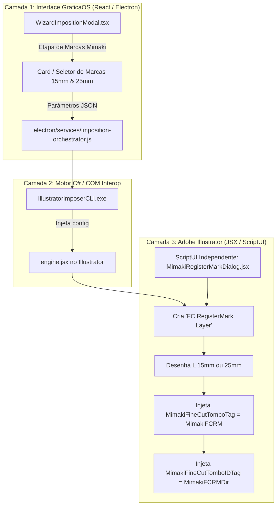

# Plano de Implementação: Modal e Automação de Marcas Mimaki FineCut (15mm / 25mm)

> **Status:** Atualizado com feedback do usuário  
> **Preferências Alinhadas:** Presets de tamanho de marca **15 mm** e **25 mm**; replicação visual e funcional do modal nativo do FineCut (*Register Mark Creation*).  
> **Escopo:** Interface Gráfica (Wizard React/Electron) + ScriptUI nativo do Illustrator + Injeção de AITags no `engine.jsx` + CLI C#.

---

## 1. Visão Geral das Novas Definições

O usuário solicitou:
1. Suporte prioritário aos tamanhos de marca **15 mm** e **25 mm** (conforme constatado no `FineCutPrefs.xml` da máquina, onde 25 mm é a marca padrão para rolo na gráfica e 15 mm para tiragens médias).
2. **Mesmo modal do Illustrator**: Criar uma interface idêntica ao diálogo nativo do FineCut (*Register Mark Creation* / `[TOMBO_DIALOG]`), permitindo controle total das opções de marca tanto no **Wizard do GraficaOS** quanto em um **ScriptUI no Adobe Illustrator**.

---

## 2. Anatomia do Modal do FineCut Replicado

Analisando o arquivo de strings do plugin (`Language\English.tfd`), o modal original do FineCut contém os seguintes campos:

```
┌────────────────────────────────────────────────────────────────────────┐
│  Mimaki FineCut - Register Mark Creation                               │
├────────────────────────────────────────────────────────────────────────┤
│  Formato da Marca (Shape):                                             │
│  (●) Tipo 1 (OutTombo / Cantoneiras Externas em "L")                   │
│  ( ) Tipo 2 (InTombo / Cantoneiras Internas)                           │
│                                                                        │
│  Tamanho da Marca (Mark Size):                                         │
│  [ [ 15 mm ] ]   [ [ 25 mm ] ]   [ Outro: [____] mm ]                  │
│                                                                        │
│  Espessura do Traço (Line Width):                                      │
│  [ 1.0 mm ] (0.5 mm - 2.0 mm)                                          │
│                                                                        │
│  Margem / Recuo da Faca (Offset):                                      │
│  [ 10.0 mm ]                                                           │
│                                                                        │
│  Opções da Marca (Options):                                            │
│  [x] Deixar retângulo como linha de corte (AddRectangleLine)           │
│  [x] Inserir marca de sentido de impressão (Print Direction Mark)       │
│  [ ] Fundo contrastante ao redor da marca (Round Fill / sensor)        │
│  [ ] Marcas Intermediárias (Intermediate Marks para rolos > 1.5m)      │
├────────────────────────────────────────────────────────────────────────┤
│  [ Cancelar ]                                            [ Aplicar ]   │
└────────────────────────────────────────────────────────────────────────┘
```

---

## 3. Arquitetura de Entrega em 3 Camadas



---

## 4. Mudanças Propostas no Código

### 4.1 Frontend GraficaOS (React / Tailwind)

#### [MODIFY] `src/components/imposition/wizard-imposition-modal.tsx`
- Adicionar estado para as opções de marcas Mimaki no Wizard:
  - `mimakiMarksEnabled: boolean` (default `true`)
  - `mimakiMarkSizeMm: number` (default `25` para bobinas, com botões rápidos `15 mm` e `25 mm`)
  - `mimakiLineWidthMm: number` (default `1.0`)
  - `mimakiMarginMm: number` (default `10.0`)
  - `mimakiAddDirectionMark: boolean` (default `true`)
  - `mimakiMakeFrame: boolean` (default `true`)
  - `mimakiIntermediateMarks: boolean` (default `false`)
- Adicionar visual idêntico ao painel do FineCut dentro da Etapa 2 (Substrato & Grade) ou como um sub-modal popup de "Configurar Marcas Mimaki".
- Enviar as propriedades no payload de `imposition:execute-job`.

---

### 4.2 Orquestrador Electron

#### [MODIFY] `electron/services/imposition-orchestrator.js`
- Repassar os campos de `mimakiMarks` recebidos de `params` para o payload JSON do `IllustratorImposerCLI`:
```javascript
MimakiMarks: {
  Enabled: Boolean(params.mimakiMarksEnabled ?? true),
  SizeMm: Number(params.mimakiMarkSizeMm || 25),
  LineWidthMm: Number(params.mimakiLineWidthMm || 1.0),
  MarginMm: Number(params.mimakiMarginMm || 10.0),
  AddDirectionMark: Boolean(params.mimakiAddDirectionMark ?? true),
  MakeFrame: Boolean(params.mimakiMakeFrame ?? true),
  IntermediateMarks: Boolean(params.mimakiIntermediateMarks ?? false),
}
```

---

### 4.3 Motor C# (`sidecars/IllustratorImposerCLI`)

#### [MODIFY] `sidecars/IllustratorImposerCLI/Program.cs`
- Adicionar classe e propriedades no `ImpositionConfig`:
```csharp
public class MimakiMarkConfig
{
    [JsonPropertyName("Enabled")]
    public bool Enabled { get; set; } = true;

    [JsonPropertyName("SizeMm")]
    public double SizeMm { get; set; } = 25.0; // 15 ou 25

    [JsonPropertyName("LineWidthMm")]
    public double LineWidthMm { get; set; } = 1.0;

    [JsonPropertyName("MarginMm")]
    public double MarginMm { get; set; } = 10.0;

    [JsonPropertyName("AddDirectionMark")]
    public bool AddDirectionMark { get; set; } = true;

    [JsonPropertyName("MakeFrame")]
    public bool MakeFrame { get; set; } = true;

    [JsonPropertyName("IntermediateMarks")]
    public bool IntermediateMarks { get; set; } = false;
}
```

---

### 4.4 Motor ExtendScript do Illustrator

#### [MODIFY] `sidecars/IllustratorImposerCLI/Scripts/engine.jsx`
- Adicionar a função geradora de marcas `criarMarcasRegistroMimaki(doc, bounds, config)`:
  1. Cria (ou obtém) a camada `FC RegisterMark Layer`.
  2. Calcula o retângulo de abrangência da grade de peças + margem de segurança.
  3. Desenha as 4 cantoneiras "L" com tamanho exato (15 mm ou 25 mm) e espessura (1 mm).
  4. Atribui a cada cantoneira a tag `MimakiFineCutTomboTag = "MimakiFCRM"`.
  5. Se `AddDirectionMark` ativo: desenha o triângulo indicador de sentido de impressão na margem inferior e injeta a tag `MimakiFineCutTomboIDTag = "MimakiFCRMDir"`.
  6. Se `IntermediateMarks` ativo e comprimento > 1500 mm: insere marcas intermediárias com a tag `MimakiFineCutMidReviseTomboTag = "MimakiFCMidRM"`.

#### [NEW] `scripts/illustrator/MimakiRegisterMarkDialog.jsx`
- Um script com interface nativa **Adobe ScriptUI** que qualquer operador pode executar dentro do Illustrator (via menu Arquivo > Scripts ou atalho) quando estiver trabalhando em um arquivo avulso.
- O diálogo ScriptUI replica o visual do FineCut com:
  - Botões rápidos: `[ 15 mm ]` e `[ 25 mm ]`
  - Campos de espessura e margem
  - Checkboxes de direção e moldura
  - Botões `[ Cancelar ]` e `[ Criar Marcas ]`

---

## 5. Plano de Verificação

### Teste Automatizado & Validação do Script
1. **Geração via CLI:**
   - Executar `IllustratorImposerCLI.exe` com payload configurando `SizeMm = 25` e `SizeMm = 15`.
   - Verificar se o arquivo PDF resultante contém a camada `FC RegisterMark Layer`.
2. **Reconhecimento no FineCut CC 2019:**
   - Abrir o arquivo gerado no Illustrator CC 2019.
   - Clicar em `FineCut > Plot...`.
   - **Critério de Aceite:** O FineCut abre direto com a aba *Register Mark Info* ativa, sem emitir o erro *"Register mark is not found"*.
3. **Teste do Diálogo ScriptUI no Illustrator:**
   - Abrir qualquer arte no Illustrator.
   - Executar `scripts/illustrator/MimakiRegisterMarkDialog.jsx`.
   - Clicar em 15 mm ou 25 mm e confirmar.
   - **Critério de Aceite:** Marcas criadas instantaneamente e reconhecidas pelo FineCut.
