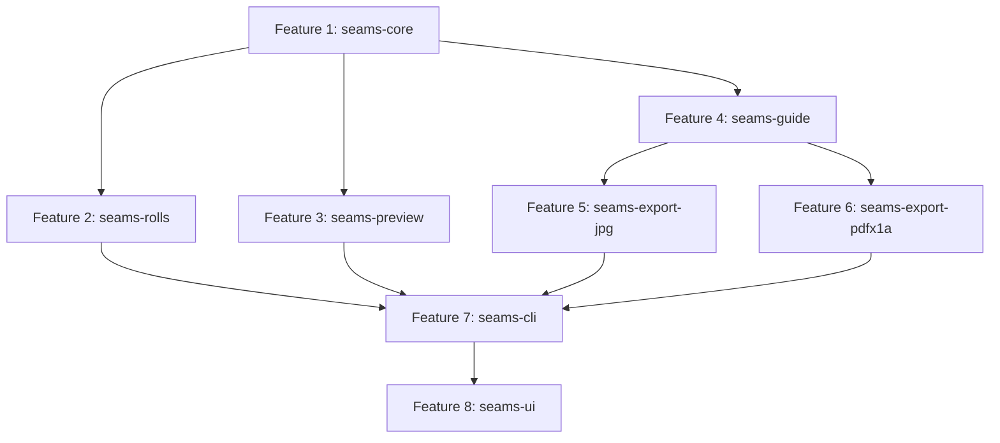

# Plano de Decomposição do Módulo Seams (Emendas de Banners) em Features SDD

> **Documento de Arquitetura e Engenharia de Software — GraficaOS**  
> **Status:** FECHADO PARA SDD  
> **Owner:** Engenharia GraficaOS  
> **Data:** 2026-09-30  
> **Referência:** PRD v3.2 (Módulo Seams / Emendas de Banners)  
> **Protocolo:** Subagent-Driven Development (`.agents/skills/subagent-driven-development/SKILL.md`)  
> **Regras Base:** `AGENTS.md` (R-009, R-013, R-019), `IMPOSICAO-MOTOR.md`, `TESTING_STRATEGY.md`

---

## Sumário Executivo

O módulo **Seams** automatiza o processo de divisão de lonas e banners de grandes formatos em painéis verticais ou horizontais que cabem na largura física dos rolos de impressão (ex: 1,60 m, 2,20 m, 3,20 m), adicionando faixas de sobreposição (*overlap*), linhas-guia de solda em CMYK (K 40%) e compensação de encolhimento térmico.

Para evitar os problemas observados no ciclo da slugline (onde a falta de fechamento prévio de contratos gerou 21 rulings, sendo 10 de contrato), **este documento fecha 100% dos contratos públicos, códigos de erro, records e regras de negócio antes de qualquer linha de código ser escrita**.

---

## ETAPA 0 — Resolução das 7 Perguntas em Aberto do PRD v3.2

| # | Pergunta | Decisão Fechada | Fundamentação Técnica | ADR / Regra |
|---|---|---|---|---|
| **1** | **Fórmula de encolhimento:** `1 cm + (metros_arredondados × 1 cm)` ou `metros × 1 cm`? | **`10 mm + (ceil(L_m) × 10 mm)`** (isto é, 1 cm fixo + 1 cm por metro linear arredondado). | A evidência empírica de fábrica demonstra que uma lona de 300 cm (3,0 m) necessita de 304 cm finais (acréscimo de 40 mm = 10 mm fixo + 3 × 10 mm). A parcela fixa compensa a fixação no tubo/garras e a parcela por metro compensa o encolhimento na cura térmica. | **ADR-049** / `BR_050_SHRINKAGE_FORMULA` |
| **2** | **Arredondamento de metros:** `2,1 m` vira `3 m` ou `2,1 m`? | **`Math.Ceiling(comprimento_m)` (Teto).** Exemplo: 2,1 m vira 3 m de passada de cura térmica. Acréscimo = 10 mm + (3 × 10 mm) = 40 mm. | O encolhimento térmico por lâmpadas UV/cura látex ocorre em passadas inteiras de secagem. Arredondar para cima é conservador e elimina peças entregues com tamanho menor que a estrutura metálica do cliente. | **ADR-049** / `BR_050_SHRINKAGE_CEILING` |
| **3** | **Encolhimento afeta a largura útil do rolo?** | **NÃO.** O encolhimento é aplicado exclusivamente no **comprimento do painel** (eixo de tração/avanço do rolo, Y). | A largura física do rolo (eixo X) é delimitada pelo cilindro de tração e cabeçote da impressora (`RollWidth - 2 × Margin`). O acréscimo de material se dá na extensão do corte longitudinal. | `BR_050_ROLL_WIDTH_ISOLATION` |
| **4** | **Linha-guia:** borda exata da sobreposição ou 1 mm dentro? | **Borda exata da sobreposição.** | A linha de 1 pt em K 40% (CMYK 0/0/0/40) marca o ponto exato onde a extremidade do painel superior deve alinhar sobre o painel inferior na mesa de solda de alta frequência. | `BR_053_GUIDE_EXACT_EDGE` |
| **5** | **Ordem padrão dos painéis:** esquerda→direita ou última usada? | **Esquerda → Direita (`LeftToRight`) no Core; UI memoriza preferência.** | O cálculo puro no Core é determinístico com default `LeftToRight` (Painel 1 no canto superior/esquerdo da arte). A UI WinUI 3 persiste a última preferência do operador via settings locais. | `BR_050_PANEL_ORDER_DEFAULT` |
| **6** | **Rolo padrão em instalação nova:** qual largura vem selecionada? | **`1600.0 mm` (1,60 m).** | 1,60 m é o padrão hegemônico da indústria de comunicação visual no Brasil para equipamentos Mimaki, Roland e HP Latex. | `BR_051_DEFAULT_ROLL_WIDTH` |
| **7** | **Margem da impressora:** 30 mm fixo ou por impressora? | **Por perfil de rolo/impressora, com default de `30.0 mm` (15 mm de cada lado).** | Cada equipamento possui um sensor de borda e presilhas metálicas distintas. O campo `PrintMarginSideMm` é customizável por perfil de rolo, defaulting para 15,0 mm em cada lateral (30 mm total). | `BR_051_ROLL_MARGIN_PROFILE` |

---

## ETAPA 1 — Decomposição em 8 Features SDD



### Resumo das Features

1. **`seams-core`**: Modelos matemáticos, cálculo de divisão em painéis, cálculo de sobreposições, compensação de encolhimento e validação estrita (R-013).
2. **`seams-rolls`**: Catálogo de rolos de mídia, margens operacionais por equipamento, cálculo do rolo ótimo para desperdício mínimo.
3. **`seams-guide`**: Posicionamento geométrico e injeção da linha-guia CMYK (K 40%) no painel de fundo.
4. **`seams-preview`**: Motor de renderização de preview multirresolução (Performance, Balanceado, Qualidade) com SkiaSharp.
5. **`seams-export-jpg`**: Pipeline de exportação de painéis em JPEG CMYK de alta performance com libjpeg-turbo.
6. **`seams-export-pdfx1a`**: Pipeline de exportação de painéis em PDF/X-1a em conformidade com ISO 15930-1 via QPDF e Content Streams.
7. **`seams-cli`**: Utilitário de linha de comando `SeamsCLI` em .NET 10 para automação headless e integração com fila de produção.
8. **`seams-ui`**: Interface gráfica desktop em WinUI 3 (estilo Kodak Preps) com preview interativo, réguas milimétricas e exportação em lote.

---

## ETAPA 2 — Contratos Públicos Fechados por Feature

---

### Feature 1 — `seams-core` (Cálculo Geométrico e Compensação)

- **Camada:** `packages/imposition-core`
- **Isolamento:** C# puro, .NET 10, Zero IO, Zero PackageReference.
- **Domínio de BR:** `BR-050`

#### Contratos Públicos

```csharp
namespace Imposition.Core.Seams;

public enum SeamOrientation
{
    Vertical = 0,   // Painéis divididos na largura (avanço vertical)
    Horizontal = 1  // Painéis divididos na altura (avanço horizontal)
}

public enum SeamDirection
{
    LeftToRight = 0, // Painel 1 no lado esquerdo / topo
    RightToLeft = 1  // Painel 1 no lado direito / base
}

/// <summary>
/// Parâmetros de entrada para o cálculo de divisão de emendas (ADR-049).
/// </summary>
public sealed record SeamsInput(
    double ArtworkWidthMm,
    double ArtworkHeightMm,
    double PrintableRollWidthMm,
    double OverlapMm,
    bool ApplyShrinkage,
    SeamOrientation Orientation = SeamOrientation.Vertical,
    SeamDirection Direction = SeamDirection.LeftToRight,
    double CustomPanelWidthMm = 0.0);

/// <summary>
/// Geometria e coordenadas de corte de um painel individual dentro da arte original.
/// </summary>
public sealed record PanelPlacement(
    int Index,
    double SourceXPositionMm,
    double SourceYPositionMm,
    double SourceWidthMm,
    double SourceHeightMm,
    double OutputWidthMm,
    double OutputHeightMm,
    double OverlapStartMm,
    double OverlapEndMm,
    double ShrinkageAllowanceMm,
    bool HasGuideLine);

/// <summary>
/// Resultado consolidado da divisão em painéis (ADR-049).
/// </summary>
public sealed record SeamsResult(
    int TotalPanels,
    IReadOnlyList<PanelPlacement> Panels,
    double TotalLinearLengthMeters,
    double TotalWasteAreaM2,
    double ShrinkageAppliedMm,
    double EffectiveRollWidthMm);
```

#### Validações Estritas (Regra R-013)

- `ArtworkWidthMm`, `ArtworkHeightMm`, `PrintableRollWidthMm` devem ser finitos (`double.IsFinite`) e `> 0`.
- `OverlapMm` deve ser finito e `>= 0` (típico: 20 mm a 50 mm; zero permitido apenas se sem sobreposição).
- `PrintableRollWidthMm` deve ser estritamente maior que `OverlapMm`.
- `CustomPanelWidthMm` deve ser finito e `>= 0`. Se `> 0`, deve ser `<= PrintableRollWidthMm`.

#### Códigos de Erro e Exceções

```csharp
namespace Imposition.Core.Errors;

public static partial class ErrorCodes
{
    public const string InvalidSeamsInput = "E_INVALID_SEAMS_INPUT";
    public const string SeamsOverlapExceedsRoll = "E_SEAMS_OVERLAP_EXCEEDS_ROLL";
    public const string SeamsArtworkExceedsMaxPanels = "E_SEAMS_ARTWORK_EXCEEDS_MAX_PANELS";
}
```

#### Regras de Negócio (BR-050)

- `BR_050.a`: Validação estrita de entradas não finitas ou menores/iguais a zero (R-013).
- `BR_050.b`: Fórmula de encolhimento térmico: `acrescimo_mm = 10.0 + (Math.Ceiling(L_mm / 1000.0) * 10.0)`.
- `BR_050.c`: Divisão uniforme ou por rolo máximo garantindo que a largura do painel com sobreposição nunca exceda a largura útil do rolo.
- `BR_050.d`: Painéis intermediários carregam sobreposição nas duas bordas; painéis de ponta apenas na borda interna.

#### Tasks de Implementação

| # | Task | Arquivos Autorizados | DoD |
|---|---|---|---|
| 1 | Modelos e Exceções | `packages/imposition-core/src/Imposition.Core/Seams/SeamsInput.cs`<br>`packages/imposition-core/src/Imposition.Core/Seams/PanelPlacement.cs`<br>`packages/imposition-core/src/Imposition.Core/Seams/SeamsResult.cs`<br>`packages/imposition-core/src/Imposition.Core/Errors/ErrorCodes.cs` | Records imutáveis compilam em `net10.0` com zero warnings. |
| 2 | Calculador de Encolhimento | `packages/imposition-core/src/Imposition.Core/Seams/ShrinkageCalculator.cs`<br>`packages/imposition-core/tests/Imposition.Core.Tests/Seams/ShrinkageCalculatorTests.cs` | Testes `BR_050_b` passam para 1 m, 2,1 m (304 cm), 3 m, 5 m e sem encolhimento. |
| 3 | Calculador de Painéis (`PanelCalculator`) | `packages/imposition-core/src/Imposition.Core/Seams/PanelCalculator.cs`<br>`packages/imposition-core/tests/Imposition.Core.Tests/Seams/PanelCalculatorTests.cs` | Divisão vertical e horizontal validada contra golden-master de fábrica. |
| 4 | Validador Estrito (`SeamsValidator`) | `packages/imposition-core/src/Imposition.Core/Seams/SeamsValidator.cs`<br>`packages/imposition-core/tests/Imposition.Core.Tests/Seams/SeamsValidatorTests.cs` | Testes de `NaN`, `Infinity`, `<= 0` e `overlap >= roll` disparam `E_INVALID_SEAMS_INPUT`. |

- **Critério de Pronto:** `dotnet test packages/imposition-core` executando 100% dos testes sem falhas e 0 warnings.

---

### Feature 2 — `seams-rolls` (Gestão de Rolos e Otimização)

- **Camada:** `packages/imposition-core` (cálculo de otimização) + repositório de persistência local.
- **Domínio de BR:** `BR-051`

#### Contratos Públicos

```csharp
namespace Imposition.Core.Rolls;

/// <summary>
/// Especificação física de um rolo de substrato.
/// </summary>
public sealed record RollSpecification(
    string Id,
    string Name,
    double PhysicalWidthMm,
    double MarginLeftMm,
    double MarginRightMm,
    double UsableWidthMm)
{
    public static RollSpecification Create(string id, string name, double physicalWidthMm, double marginSideMm = 15.0)
    {
        var usable = physicalWidthMm - (2.0 * marginSideMm);
        return new RollSpecification(id, name, physicalWidthMm, marginSideMm, marginSideMm, usable);
    }
}

/// <summary>
/// Sugestão de rolo ótimo para um banner específico.
/// </summary>
public sealed record RollSuggestion(
    RollSpecification SelectedRoll,
    int PanelCount,
    double TotalWasteM2,
    double WastePercentage,
    bool RequiresRotation);

public interface IRollRepository
{
    IReadOnlyList<RollSpecification> GetAll();
    RollSpecification? GetById(string id);
    void Save(RollSpecification roll);
}
```

#### Tasks de Implementação

| # | Task | Arquivos Autorizados | DoD |
|---|---|---|---|
| 1 | Catálogo Padrão de Rolos | `packages/imposition-core/src/Imposition.Core/Rolls/RollSpecification.cs`<br>`packages/imposition-core/src/Imposition.Core/Rolls/DefaultRolls.cs` | Rolos de 1,00 m, 1,20 m, 1,40 m, 1,60 m, 2,20 m, 3,20 m pré-configurados. |
| 2 | Algoritmo de Sugestão de Rolo Ótimo | `packages/imposition-core/src/Imposition.Core/Rolls/RollSuggester.cs`<br>`packages/imposition-core/tests/Imposition.Core.Tests/Rolls/RollSuggesterTests.cs` | Testes `BR_051_*` comparam desperdício de área e elegem o rolo com menor refugo. |
| 3 | Repositório JSON Local | `packages/imposition-core/src/Imposition.Core/Rolls/JsonRollRepository.cs`<br>`packages/imposition-core/tests/Imposition.Core.Tests/Rolls/JsonRollRepositoryTests.cs` | Leitura e persistência de customizações do operador sem corromper estado padrão. |

- **Critério de Pronto:** `dotnet test packages/imposition-core --filter Category=Rolls` 100% verde.

---

### Feature 3 — `seams-preview` (Motor de Preview SkiaSharp 3 Modos)

- **Camada:** `packages/imposition-render` (novo projeto com SkiaSharp)
- **Domínio de BR:** `BR-052`

#### Contratos Públicos

```csharp
namespace Imposition.Render.Preview;

public enum PreviewRenderMode
{
    Performance = 0, // Thumbnail rápido com downscale agressivo (< 50ms)
    Balanced = 1,    // Resolução média para edição interativa (< 150ms)
    Quality = 2      // Full-DPI para inspeção detalhada de emendas e corte
}

public sealed record SeamPreviewRequest(
    string ImagePath,
    SeamsResult SeamsResult,
    PreviewRenderMode Mode,
    int TargetViewportWidthPx,
    int TargetViewportHeightPx,
    bool ShowCutLines = true,
    bool ShowGuideLines = true,
    bool ShowOverlapShading = true);

public sealed record SeamPreviewResult(
    byte[] EncodedImagePng,
    int RenderWidthPx,
    int RenderHeightPx,
    long ElapsedMilliseconds,
    PreviewRenderMode ExecutedMode);
```

#### Tasks de Implementação

| # | Task | Arquivos Autorizados | DoD |
|---|---|---|---|
| 1 | Estrutura do Pacote `imposition-render` | `packages/imposition-render/Imposition.Render.csproj`<br>`packages/imposition-render/src/Imposition.Render/Preview/SeamPreviewRequest.cs` | Projeto .NET 10 com dependência estrita de SkiaSharp e referência a `imposition-core`. |
| 2 | Pipeline de Downsampling e Cache | `packages/imposition-render/src/Imposition.Render/Preview/PreviewBitmapCache.cs` | Cache em memória por hash de arquivo e modo, evitando redecodificar bitmaps gigabyte. |
| 3 | Overlays de Corte e Emendas | `packages/imposition-render/src/Imposition.Render/Preview/SeamOverlayPainter.cs` | Desenho de linhas pontilhadas de corte, hachura semi-transparente de sobreposição e linha-guia K40%. |
| 4 | Preview Engine Integrado | `packages/imposition-render/src/Imposition.Render/Preview/SeamsPreviewEngine.cs`<br>`packages/imposition-render/tests/Imposition.Render.Tests/SeamsPreviewTests.cs` | Benchmark: modo Performance renderiza em < 50ms para imagem 300 DPI de 5 metros. |

- **Critério de Pronto:** `dotnet test packages/imposition-render` passando todos os testes de renderização.

---

### Feature 4 — `seams-guide` (Linha-Guia K40% em PDF e Raster)

- **Camada:** `packages/imposition-pdf` (vetorial QDF) e `packages/imposition-render` (raster)
- **Domínio de BR:** `BR-053`

#### Contratos Públicos

```csharp
namespace Imposition.Core.Seams;

/// <summary>
/// Posicionamento exato da linha-guia no painel de baixo.
/// </summary>
public sealed record GuideLineDefinition(
    int TargetPanelIndex,
    double XPositionMm,
    double YPositionMm,
    double LengthMm,
    double ThicknessPt,
    double Cyan,
    double Magenta,
    double Yellow,
    double Black)
{
    public static GuideLineDefinition CreateStandard(int panelIndex, double xMm, double yMm, double lengthMm) =>
        new(panelIndex, xMm, yMm, lengthMm, 1.0, 0.0, 0.0, 0.0, 0.40); // 1 pt, K 40%
}
```

#### Tasks de Implementação

| # | Task | Arquivos Autorizados | DoD |
|---|---|---|---|
| 1 | Geometria da Linha-Guia no Core | `packages/imposition-core/src/Imposition.Core/Seams/GuideLineCalculator.cs`<br>`packages/imposition-core/tests/Imposition.Core.Tests/Seams/GuideLineCalculatorTests.cs` | Cálculo exato de coordenadas X/Y no painel inferior para divisão vertical e horizontal. |
| 2 | Injeção Vetorial no Content Stream PDF | `packages/imposition-pdf/src/Imposition.Pdf/Seams/PdfSeamGuideInjector.cs`<br>`packages/imposition-pdf/tests/Imposition.Pdf.Tests/PdfSeamGuideTests.cs` | Injeção de operadores PDF CMYK `0 0 0 0.40 k` e linha `1 w` sem rasterizar o PDF. |
| 3 | Injeção Raster para Imagens (JPG/TIFF) | `packages/imposition-render/src/Imposition.Render/Seams/RasterSeamGuidePainter.cs` | Desenho da linha K40% em SkiaSharp com conversão exata de espaço de cores CMYK. |

- **Critério de Pronto:** Testes automatizados verificam o stream PDF e confirmam a presença do operador `0 0 0 0.4 k`.

---

### Feature 5 — `seams-export-jpg` (Exportação JPG CMYK Max Quality)

- **Camada:** `packages/imposition-render` (libjpeg-turbo P/Invoke)
- **Domínio de BR:** `BR-054`

#### Contratos Públicos

```csharp
namespace Imposition.Render.Export;

public sealed record JpgExportOptions(
    int Quality = 100,
    int Dpi = 150,
    bool EmbedIccProfile = true,
    string NamingPattern = "{job}_painel_{index:D2}.jpg");

public sealed record JpgExportResult(
    IReadOnlyList<string> GeneratedFiles,
    long TotalBytes,
    TimeSpan ElapsedTime);

public interface IJpgPanelExporter
{
    Task<JpgExportResult> ExportPanelsAsync(
        string sourceImagePath,
        SeamsResult seamsResult,
        string outputDirectory,
        JpgExportOptions options,
        IProgress<double>? progress = null,
        CancellationToken cancellationToken = default);
}
```

#### Tasks de Implementação

| # | Task | Arquivos Autorizados | DoD |
|---|---|---|---|
| 1 | Wrapper P/Invoke libjpeg-turbo CMYK | `packages/imposition-render/src/Imposition.Render/Native/LibJpegTurboNative.cs`<br>`packages/imposition-render/src/Imposition.Render/Native/NativeLoader.cs` | P/Invoke nativo 64-bit para codificação direta de buffer CMYK sem conversão destrutiva para RGB. |
| 2 | Splitter e Cropper Raster por Painel | `packages/imposition-render/src/Imposition.Render/Export/RasterPanelSplitter.cs` | Fatiamento da imagem fonte em blocos de memória respeitando coordenadas de sobreposição e sangria. |
| 3 | Exportador de Lote com Notificação | `packages/imposition-render/src/Imposition.Render/Export/JpgPanelExporter.cs`<br>`packages/imposition-render/tests/Imposition.Render.Tests/JpgPanelExporterTests.cs` | Exportação assíncrona gerando arquivos com nomenclatura padronizada e DPI correto nos cabeçalhos EXIF/JFIF. |

- **Critério de Pronto:** `dotnet test packages/imposition-render --filter Category=JpgExport` validando arquivos JPEG gerados com preflight de dimensões e canais.

---

### Feature 6 — `seams-export-pdfx1a` (Exportação PDF/X-1a ISO 15930-1)

- **Camada:** `packages/imposition-pdf` (QPDF + OutputIntent ISO)
- **Domínio de BR:** `BR-055`

#### Contratos Públicos

```csharp
namespace Imposition.Pdf.Seams;

public sealed record PdfxExportOptions(
    string OutputConditionIdentifier = "CGATS TR 001",
    string Info = "U.S. Web Coated (SWOP) v2",
    string NamingPattern = "{job}_painel_{index:D2}.pdf");

public sealed record PdfxExportResult(
    IReadOnlyList<string> GeneratedPdfFiles,
    bool IsPdfX1aCompliant,
    TimeSpan ElapsedTime);

public interface IPdfxPanelExporter
{
    Task<PdfxExportResult> ExportPanelsAsync(
        string sourcePdfPath,
        SeamsResult seamsResult,
        string outputDirectory,
        PdfxExportOptions options,
        CancellationToken cancellationToken = default);
}
```

#### Tasks de Implementação

| # | Task | Arquivos Autorizados | DoD |
|---|---|---|---|
| 1 | Subdivisão de PDF com QPDF Preservando Vetores | `packages/imposition-pdf/src/Imposition.Pdf/Seams/QpdfPanelSplitter.cs` | Uso de crop boxes e transform matrix no QPDF sem rasterizar camadas ou perder dados vetoriais. |
| 2 | Injeção de Dicionário OutputIntent PDF/X-1a | `packages/imposition-pdf/src/Imposition.Pdf/Preflight/PdfxOutputIntentInjector.cs` | Injeção estrutural de GTS_PDFX, OutputCondition e ICC de perfil SWOP/Fogra. |
| 3 | Pipeline Consolidado de Exportação PDF | `packages/imposition-pdf/src/Imposition.Pdf/Seams/PdfxPanelExporter.cs`<br>`packages/imposition-pdf/tests/Imposition.Pdf.Tests/PdfxPanelExporterTests.cs` | Geração de PDFs de painéis validados por checklist de pré-impressão. |

- **Critério de Pronto:** `dotnet test packages/imposition-pdf --filter Category=Seams` 100% aprovado.

---

### Feature 7 — `seams-cli` (Automação Headless de Linha de Comando)

- **Camada:** `sidecars/SeamsCLI` (.NET 10 Console App)
- **Domínio de BR:** `BR-056`

#### Contratos Públicos e CLI Interface

```
Uso: SeamsCLI [opções] <arquivo-origem>

Argumentos:
  <arquivo-origem>               Caminho para arquivo PDF, JPG ou TIFF

Opções:
  -r, --roll <largura_mm>        Largura total do rolo em mm (default: 1600)
  -m, --margin <margem_mm>       Margem de segurança lateral em mm (default: 15)
  -o, --overlap <sobrepos_mm>    Largura da sobreposição/emenda em mm (default: 30)
  -s, --shrinkage                Aplica compensação de encolhimento térmico
  --orientation <vert|horiz>     Orientação da divisão dos painéis (default: vert)
  --format <pdf|jpg>             Formato de saída dos painéis (default: jpg)
  -d, --outdir <diretório>       Diretório de saída (default: pasta do arquivo)
  --json                         Emite RESULT_JSON estruturado no stdout
```

#### Tasks de Implementação

| # | Task | Arquivos Autorizados | DoD |
|---|---|---|---|
| 1 | Parser CLI e Definição de Comandos | `sidecars/SeamsCLI/Program.cs`<br>`sidecars/SeamsCLI/CommandLine/SeamsCliOptions.cs` | Parser com `System.CommandLine` e tratamento amigável de erros em PT-BR. |
| 2 | Orquestração do Pipeline (Core + Exporters) | `sidecars/SeamsCLI/Execution/SeamsWorkflowExecutor.cs` | Roteamento automático para exportador JPG ou PDF dependendo das flags. |
| 3 | Saída Estruturada RESULT_JSON (Regra R-019) | `sidecars/SeamsCLI/Execution/JsonResultEmitter.cs`<br>`sidecars/SeamsCLI/tests/SeamsCLI.Tests/CliIntegrationTests.cs` | Emissão de JSON de desfecho estritamente após a conclusão das operações. |

- **Critério de Pronto:** Execução do CLI via script de teste processa um arquivo de 3 m e gera os painéis com código de saída 0.

---

### Feature 8 — `seams-ui` (Interface Desktop WinUI 3)

- **Camada:** `sidecars/SeamsApp` (WinUI 3 / .NET 10 Windows)
- **Domínio de BR:** `BR-057`

#### Contratos de ViewModels e Eventos

```csharp
namespace SeamsApp.ViewModels;

public sealed partial class MainViewModel : ObservableObject
{
    [ObservableProperty] private string _selectedFilePath = string.Empty;
    [ObservableProperty] private double _artworkWidthMm;
    [ObservableProperty] private double _artworkHeightMm;
    [ObservableProperty] private RollSpecification _selectedRoll;
    [ObservableProperty] private double _overlapMm = 30.0;
    [ObservableProperty] private bool _applyShrinkage = true;
    [ObservableProperty] private SeamsResult? _calculatedResult;
    [ObservableProperty] private bool _isProcessing;
    
    [RelayCommand] public async Task LoadFileAsync(string path);
    [RelayCommand] public void RecalculateSeams();
    [RelayCommand] public async Task ExportPanelsAsync();
}
```

#### Tasks de Implementação

| # | Task | Arquivos Autorizados | DoD |
|---|---|---|---|
| 1 | Shell WinUI 3 e Layout Estilo Preps | `sidecars/SeamsApp/Views/MainWindow.xaml`<br>`sidecars/SeamsApp/Views/Controls/CanvasRulerControl.xaml` | Janela principal com painel de propriedades à esquerda e viewport à direita. |
| 2 | Viewport com Zoom/Pan e Overlays em Tempo Real | `sidecars/SeamsApp/Views/Controls/SeamsInteractiveCanvas.cs`<br>`sidecars/SeamsApp/ViewModels/PreviewCanvasViewModel.cs` | Interação suave a 60 FPS com manipulação de linhas de corte e sobreposição. |
| 3 | Integração de Exportação com Barra de Progresso | `sidecars/SeamsApp/ViewModels/ExportViewModel.cs`<br>`sidecars/SeamsApp/Views/Dialogs/ExportProgressDialog.xaml` | Exportação em lote em segundo plano sem travar a interface gráfica. |

- **Critério de Pronto:** Aplicação abre, carrega imagem de teste, divide painéis e exporta via interface.

---

## ETAPA 3 — Ordem de Execução e Dependências

| Ordem | Feature | Dependências Obrigatórias (Mergeadas em `main`) | Rationale de Arquitetura |
|:---:|---|---|---|
| **1** | **`seams-core`** | *Nenhuma* | Base matemática pura. Toda a geometria depende deste pacote. |
| **2** | **`seams-rolls`** | `seams-core` | Necessita das regras de validação e modelos básicos do Core. |
| **3** | **`seams-guide`** | `seams-core` | Define o posicionamento da linha-guia sobre os painéis calculados. |
| **4** | **`seams-preview`** | `seams-core`, `seams-guide` | O renderizador visual precisa desenhar as emendas e a linha-guia. |
| **5** | **`seams-export-jpg`** | `seams-core`, `seams-guide` | Exporta as fatias raster com a linha-guia incorporada. |
| **6** | **`seams-export-pdfx1a`**| `seams-core`, `seams-guide` | Subdivide arquivos vetoriais com a linha-guia em QDF. |
| **7** | **`seams-cli`** | `seams-rolls`, `seams-export-jpg`, `seams-export-pdfx1a` | Empacota todo o pipeline em uma interface de linha de comando. |
| **8** | **`seams-ui`** | `seams-cli`, `seams-preview` | Interface visual de alto nível que consome preview e orquestração. |

---

## ETAPA 4 — Checklist de Entrada no SDD (Gating Estrito)

Antes de abrir a branch e instanciar o ledger (`.sdd/<feature>/progress.md`) para qualquer uma das features acima, verificar os seguintes requisitos obrigatórios:

- [x] Contratos públicos fechados e documentados (Records, Enums, Interfaces).
- [x] IDs de Business Rules reservados (`BR_050` a `BR_057`).
- [x] Códigos de erro (`ErrorCodes`) cadastrados com nomenclatura `E_*`.
- [x] Lista exata de arquivos autorizados delimitada por task.
- [x] Critério de pronto (DoD) com comando executável de teste.
- [x] Dependências de código mergeadas na branch principal.
- [x] Regras R-009 (Encoding), R-013 (`double.IsFinite`) e R-019 (Outcome Fields) incorporadas nos prompts de implementação e revisão.

> **Se qualquer item estiver incompleto, o ciclo SDD daquela feature NÃO PODE SER INICIADO.**

---

## ETAPA 5 — Estimativa de Rulings e Riscos Mapeados

| Feature | Estimativa de Rulings Totais | Rulings de Contrato Estimados | Principal Risco Mapeado |
|---|:---:|:---:|---|
| `seams-core` | ≤ 2 | **0** (Contrato 100% fechado) | Comparação de ponto flutuante em bordas de divisão de painéis (resolvido com tolerância de 0,1 mm). |
| `seams-rolls` | ≤ 2 | **0** | Critério de desempate quando dois rolos têm desperdício similar (resolvido por menor número de emendas). |
| `seams-guide` | ≤ 3 | ≤ 1 | Conversão de cor K40% em diferentes espaços de cores (RGB vs CMYK). |
| `seams-preview` | ≤ 3 | **0** | Consumo de memória em imagens de altíssima resolução (resolvido por downscale agressivo no cache). |
| `seams-export-jpg` | ≤ 3 | **0** | Compatibilidade de binários nativos libjpeg-turbo em diferentes ambientes Windows. |
| `seams-export-pdfx1a` | ≤ 3 | **0** | Preservação de fontes e OCG em PDFs complexos de entrada. |
| `seams-cli` | ≤ 2 | **0** | Formatação de saída do `RESULT_JSON` em caso de cancelamento/erro (Regra R-019). |
| `seams-ui` | ≤ 4 | **0** | Performance de redesenho no Canvas interativo durante o redimensionamento da janela. |

---

## Conclusão e Próximo Passo

Com os contratos, regras e decomposição fechados neste documento:
1. **O plano está pronto e congelado.**
2. A próxima ação de engenharia é o início do ciclo **SDD da Feature 1 (`seams-core`)**.
