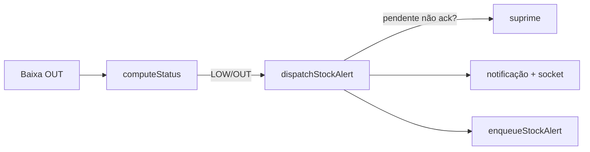

# WhatsApp & Alertas — GraficaOS

> **Status:** ATIVA (INT-004) · **REWRITE do histórico** `docs/15_WHATSAPP_ALERTAS_ARQUITETURA.md` (desatualizado: o código evoluiu p/ multi-destinatário) — arquivado.
> **Código:** `grafica-app/backend/src/lib/whatsapp.ts`, `lib/notification-resend.ts`, `routes/whatsapp.ts`, `db/schema.ts` (tabela `whatsapp_recipients`).
> **Decisão de canal pendente:** Baileys vs WhatsApp Business API (INT-101) → RFC/ADR-012.

---

## 1. Geração do alerta (transição de estado — BR-015)

`dispatchStockAlert` (`lib/notification-resend.ts:23-91`):
1. Verifica se já existe notificação **pendente não reconhecida** para o mesmo item + `alertLevel` (`:30-48`) → se sim, **não envia de novo** (anti-spam).
2. Insere `notifications` (`:63-72`) e emite `notification:new` (sala `estoque`).
3. Se `whatsapp.enabled === 'true'` (`:78`), enfileira alerta (`enqueueStockAlert`).

## 2. Envio (humanizado — BR-016)

`lib/whatsapp.ts`:
- **Batching 3,5s** (`BATCH_WINDOW_MS = 3500`): alertas no mesmo intervalo viram **uma mensagem** (`formatStockAlertsMessage`, `:248-278`).
- **Fila FIFO** (`processOutboundQueue`, `:347-378`): pausa se desconectado; **dedupe de texto idêntico** (`:328-333`); **cooldown 5–8s** entre mensagens diferentes (`:371`).
- **Destinatários** (`resolveRecipients`, `:204-233`): grupo (`whatsapp.groupId`) + `whatsapp_recipients` ativos (principal/backup) + fallback `whatsapp.phone`.
- **Números BR** prefixados com `55` (`normalizedPhone`).
- **Sessão Baileys**: QR da UI (painel), `wa_auth/`, reconexão automática; queue persistida em memória.
- Comandos do chat são **DM privada** (BR-020).

## 3. Estado atual vs promessas antigas (honestidade BR-017)

| Item | Realidade |
|------|-----------|
| Multi-destinatário | ✅ implementado (`whatsapp_recipients`) — doc antigo reflete pré-tabela |
| Grupo | ✅ suportado (`groupId` → `@g.us`) |
| Briefing agendado 07:35/17:30 | ❌ **não implementado** (BR-017/PROPOSED) |
| Alerta de mensagem interna via WhatsApp | ❌ não existe (só notificação in-app) |
| WhatsApp Business API oficial | ❌ Baileys hoje (risco Meta) — INT-101/ADR-012 |

## 4. Lacunas e direção

1. Migração optativa p/ **WhatsApp Business API** (INT-101) quando volume/confiança justificarem — ADR-012 pendente.
2. Briefing agendado (BR-017): depende de scheduler; decisão de produto pendente.
3. Constantes de humanização viram config por empresa (BR-021): `messaging.whatsapp.humanization`.
4. Canal alternativo barato: e-mail (INT-104).

## 5. Troubleshooting

| Sintoma | Causa | Solução |
|---------|-------|---------|
| Sem alerta WhatsApp | `whatsapp.enabled` ≠ `'true'` ou sem destinatário | painel Config; `resolveRecipients` |
| Sem reenvio ao persistir LOW | pendente não ack (BR-015) | reconhecer a notificação |
| Fila parada | desconectado | aguardar reconexão; fila preserva mensagens |