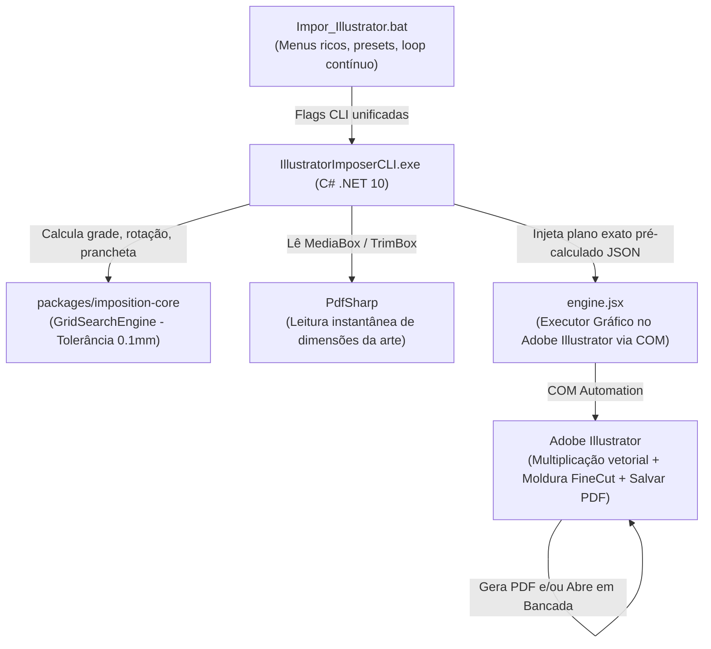

# Plano de Implementação — Unificação do IllustratorImposerCLI com o Motor Core e Menus do ImpositionCLI

> **Status:** Proposto para aprovação  
> **Componentes Afetados:**  
> - `sidecars/IllustratorImposerCLI/` (`IllustratorImposerCLI.csproj`, `Program.cs`, `Scripts/engine.jsx`)  
> - `Impor_Illustrator.bat`  
> - Referência compartilhada a `packages/imposition-core/`

---

## 1. Descrição do Problema e Visão Geral

Atualmente, o repositório possui dois motores de imposição principais que divergiam em regras matemáticas e experiência de uso:

1. **AutoImposerCLI (Motor 1 / Headless PDF):**
   - Consome a biblioteca central **`Imposition.Core`** (`GridSearchEngine`), que é a fonte única de verdade matemática da gráfica (Regra 1 do AGENTS.md: tolerância física 0,1 mm, sem epsilon mágico).
   - Suporta tanto **chapa fixa** (700x1000, SRA3, etc.) com cálculo de capacidade máxima e tratamento de excesso de tiragem (Exit Code 4 e multi-rodadas `OPTION_*`), quanto **rolo/bobina** com auto-extensão de comprimento.
   - Oferece um menu interativo completo no [`MontarPDF.bat`](file:///C:/Users/impressao/Desktop/dpi-controle-estoque-main/dpi-controle-estoque-main/MontarPDF.bat).

2. **IllustratorImposerCLI (Motor 2 / Adobe Illustrator COM):**
   - Não consumia o `Imposition.Core`. Todo o cálculo de colunas, linhas e rotação era feito em JavaScript interno (`engine.jsx`) com epsilon mágico `0.000001` e loops próprios de fatores.
   - Suportava apenas rolo (auto-estendia sempre o comprimento) e não tinha verificação de capacidade de chapas fixas.
   - O arquivo [`Impor_Illustrator.bat`](file:///C:/Users/impressao/Desktop/dpi-controle-estoque-main/dpi-controle-estoque-main/Impor_Illustrator.bat) tinha um menu básico (apenas largura, tiragem, gap e margem), sem os formatos padrão, opções de rotação, sobras ou tratamento de excesso.

### Objetivo da Mudança:
Replicar **100% da lógica e sofisticação do AutoImposerCLI no IllustratorImposerCLI**:
1. **Motor C# Unificado:** O `IllustratorImposerCLI` passa a referenciar `Imposition.Core` e usar o `GridSearchEngine`. O cálculo de aproveitamento, colunas, linhas, rotação e posições é exatamente idêntico nos dois motores.
2. **Suporte a Chapa Fixa e Rolo:** Permite rodar no Illustrator tanto em formato fixo (700x1000, SRA3 330x480, etc.) quanto em rolo/bobina.
3. **Tratamento de Excesso de Capacidade:** Em formatos fixos, se a tiragem solicitada exceder a chapa, dispara o protocolo de sugestão de rodadas (Exit Code 4 com `OPTION_*`).
4. **Moldura Delimitadora para FineCut (Mimaki):** Conforme alinhado, o script desenha uma moldura/retângulo centralizado no tamanho exato da grade imposta em uma camada dedicada (`FineCut_Moldura`). Isso permite que o operador no modo bancada apenas selecione o quadro e aplique o comando "Frame Registration Marks" do FineCut sem precisar calcular coordenadas manuais.
5. **Script Batch Espelhado:** O [`Impor_Illustrator.bat`](file:///C:/Users/impressao/Desktop/dpi-controle-estoque-main/dpi-controle-estoque-main/Impor_Illustrator.bat) ganha todos os menus, presets e recursos do [`MontarPDF.bat`](file:///C:/Users/impressao/Desktop/dpi-controle-estoque-main/dpi-controle-estoque-main/MontarPDF.bat) (incluindo loop contínuo e fila de arquivos).

---

## 2. Arquitetura da Solução



---

## 3. Alterações Detalhadas por Componente

### 3.1 `sidecars/IllustratorImposerCLI/IllustratorImposerCLI.csproj`
- Adicionar referência ao projeto `imposition-core`:
  ```xml
  <ProjectReference Include="../../packages/imposition-core/src/Imposition.Core/Imposition.Core.csproj" />
  ```
- Adicionar referência ao pacote `PdfSharp` (6.1.1) para leitura ultra-rápida das dimensões do PDF de entrada sem dependência do carregamento prévio do Illustrator.

---

### 3.2 `sidecars/IllustratorImposerCLI/Program.cs`
1. **Ponte de Cálculo (`ImpositionBridge`):**
   - Adicionar ou reutilizar a classe `ImpositionBridge`, conectando as entradas da linha de comando ao `GridSearchEngine.Plan`.
2. **Flags de Linha de Comando Suportadas:**
   - Posicional clássico: `<arquivo.pdf> [largura] [altura] [gap] [margem] [pasta_saida] [copias]`
   - `--substrate-kind sheet|roll`
   - `--max-length N`
   - `--rotation auto|0|90`
   - `--target-copies N`
   - `--surplus truncate|fill_row`
   - `--trim-to-content`
   - `--output-dir <caminho>`
   - `--finecut-frame 1|0` (liga/desliga desenho do retângulo para o FineCut)
   - `--open-after` (Modo Bancada) / `--silent` (Modo Silencioso)
   - `--json <payload>`
3. **Verificação de Capacidade em Chapas Fixas (Exit Code 4):**
   - Se `substrateKind == Sheet` e `targetCopies > capacidade`, imprime no `stderr` os blocos `OPTION_1_*`, `OPTION_2_*`, etc., e retorna código de saída `4`, permitindo ao `.bat` oferecer a divisão automática em rodadas.
4. **Envio do Plano Pré-calculado para o ExtendScript:**
   - Em vez de enviar parâmetros brutos e deixar o JSX adivinhar colunas e linhas, o C# envia o plano final pronto:
     - `Cols`, `Rows`, `PlannedUnits`
     - `Rotacionar90` (true/false calculado pelo core)
     - `FinalPieceWMm`, `FinalPieceHMm`
     - `ArtboardWMm`, `ArtboardHMm`
     - `StartXPt`, `StartYPt`, `StepXPt`, `StepYPt`
     - `GradeWMm`, `GradeHMm`
     - `DrawFineCutFrame` (true/false)
     - `ManterAberto` (true/false)

---

### 3.3 `sidecars/IllustratorImposerCLI/Scripts/engine.jsx`
1. **Simplificação da Lógica (Executor Puro):**
   - Eliminar cálculos manuais de `Math.floor`, loops de fatores e epsilon mágico `+0.000001`.
   - O script confia 100% nas coordenadas calculadas pelo `Imposition.Core`.
2. **Ajuste da Prancheta e Margens:**
   - Redimensiona o artboard para `ArtboardWMm × ArtboardHMm` (com ou sem `--trim-to-content`).
3. **Multiplicação com Preservação de Camadas:**
   - Mantém as camadas originais (Faca, Cor, Branco, Verniz, etc.) separadas, duplicando em cada posição `(startX + col * stepX, startY - row * stepY)`.
4. **Desenho da Moldura para o FineCut:**
   - Se `DrawFineCutFrame` for verdadeiro:
     - Cria (ou seleciona) a camada `FineCut_Moldura`.
     - Desenha um retângulo com largura `GradeWMm` e altura `GradeHMm`, posicionado exatamente no contorno exterior da grade de peças.
     - Aplica contorno preto de 0.25 pt e sem preenchimento.

---

### 3.4 `Impor_Illustrator.bat`
Reescrever o script batch para incorporar todos os menus e inteligência do [`MontarPDF.bat`](file:///C:/Users/impressao/Desktop/dpi-controle-estoque-main/dpi-controle-estoque-main/MontarPDF.bat):
1. **Menu de Formato da Chapa / Rolo:**
   - `[1] Chapa 700 x 1000 mm (Padrao)`
   - `[2] Meia Chapa 500 x 700 mm`
   - `[3] Chapa Grande 1000 x 1500 mm`
   - `[4] Folha SRA3 330 x 480 mm (Konica)`
   - `[5] Personalizado (definir dimensoes)`
   - `[6] Rolo/Bobina Mimaki (largura boca + comprimento maximo)`
2. **Ajustes:**
   - Gap entre peças
   - Margem da chapa
   - Fechar prancheta na grade (`--trim-to-content`)
3. **Opção de Moldura para FineCut:**
   - `[ENTER] Sim (desenhar retangulo delimitador para FineCut)`
   - `[0] Nao`
4. **Orientação / Rotação:**
   - `[1] Automatico (melhor aproveitamento 0 ou 90 graus)`
   - `[2] Forcar Direto (0 graus)`
   - `[3] Forcar Rotacionado (90 graus)`
5. **Tiragem e Sobras:**
   - Capacidade máxima vs Número específico
   - Sobra: fechar linha (`fill_row`) vs corte exato (`truncate`)
6. **Modo de Execução:**
   - `[1] MODO BANCADA (Abre o Illustrator maximizado pronto para o FineCut) [ENTER]`
   - `[2] MODO SILENCIOSO (Gera o PDF em segundo plano e fecha o Illustrator)`
7. **Tratamento de Excesso de Capacidade:**
   - Menu automático de multi-rodadas caso o pedido não caiba na chapa escolhida.
8. **Loop Contínuo e Suporte a Múltiplos Arquivos:**
   - Conforme implementado na tarefa anterior, o script não fecha e permite processar novos arquivos sucessivamente.

---

## 4. Plano de Verificação

### Testes Automatizados (.NET)
1. **Compilação do Core e dos Motores:**
   ```powershell
   dotnet build packages/imposition.slnx -c Release
   dotnet build sidecars/IllustratorImposerCLI/IllustratorImposerCLI.csproj -c Release
   ```
2. **Testes do Imposition.Core:**
   ```powershell
   dotnet test packages/imposition-core/tests/Imposition.Core.Tests -c Release
   ```
   Garante que nenhum teste de regressão ou golden-master quebre.

### Testes de Integração e CLI
1. **Validação de Linha de Comando no `IllustratorImposerCLI.exe`:**
   - Executar com `--help` e verificar novas opções.
   - Testar o caso canônico golden-master (`dummy_19x34.pdf` em SRA3 330x480 mm) e validar o cálculo do `GridSearchEngine`.
   - Testar disparo do Exit Code 4 quando tiragem ultrapassa capacidade de chapa fixa.
2. **Validação do Script `Impor_Illustrator.bat`:**
   - Teste de fluxo interativo em Chapa Fixa e em Rolo.
   - Teste do loop contínuo e encerramento limpo com Enter vazio.
   - Teste da criação do retângulo delimitador FineCut.
